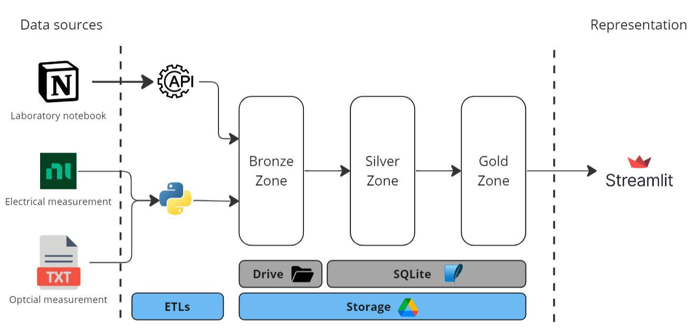
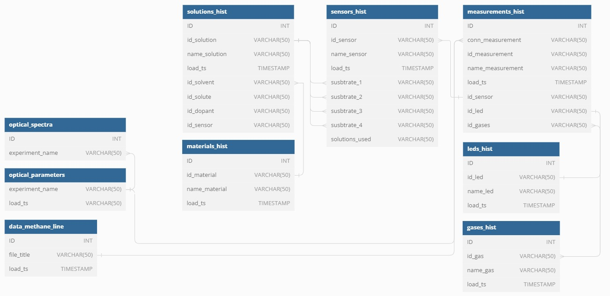
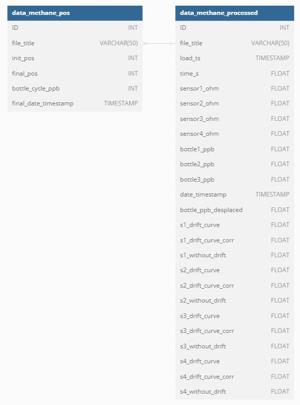
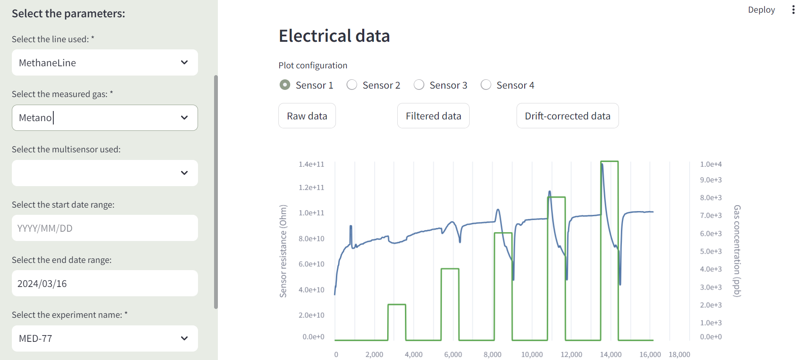

# NOySI lab project
Welcome to this project designed in the Nanosensors and Intelligent Systems (NOySI) research group of CSIC.

### 🎯 The project description
The objective of the project is to realize the data infrastructure of the research group and to perform the whole process of ingestion, cleaning, processing and calculations to facilitate decision making based on the experiments performed.

### 📑 Dataset
The data are from experiments carried out by the CSIC research group NOySI.

### 🚀 Pipeline
The high-level pipeline can be seen in the schematic below. Subsequently, the different phases carried out are described: 

There are three sources of data:
- Notion.
- tdms files (electrical data).
- txt files (optical data).
The data is ingested and stored in the bronze zone in raw json (notion) and csv (tdms and txt) files. These data are then read and stored in the silver zone database (see below). Finally, the data is cleaned, processed and aggregated to be stored in the gold zone tables.
The data are plotted in streamlit to be able to visualize the test results. Streamlit connects to both the silver and gold zone databases.

### 🧠 Data Model
This project includes a database in the silver zone and another in the gold zone. The star (silver) data model consists of 9 tables. The reduced schema is shown below (not all variables are shown so that it can be visualized well, all variables can be seen in the 'variable_mapping' tab):

On the other hand, the database (gold) is made up of two tables as shown in the following image:

### 📊 Visualization
This is the visualization on streamlit

### 💻 Technology stack
- Python==3.9.18
  - pandas==2.1.1
  - numpy==1.26.0
  - request==2.31.0
  - dotenv
  - json==4.21.1
  - scipy==1.11.4
  - duckdb==0.9.2
  - notion_client==2.2.1
  - nptdms==1.7.1
- DBeaver==23.3.2
- sqlite==3.41.2
- streamlit==1.31.1
- streamlit-authenticator

### 📁 Folder structure
    ├── .gitignore
    ├── README.md
    ├── LICENSE
    ├── img
    ├── main.py
    ├── modules
    |   ├── alter_tables_silver.sql
    |   ├── create_tables_silver.sql
    |   ├── create_tables_gold.sql
    |   ├── cduckdb.py
    |   ├── electrical_processing.py
    |   ├── electrical_read_transform.py
    |   ├── notion_read_transform.py
    |   ├── optical_read_transform.py
    |   └── read_directory.sql
    ├── notebooks
    |   └── normalize_data.py
    ├── pages
    |   ├── 1-Analysis.py
    |   └── 2-ML.py
    └── data
        ├── Bronze
        ├── Silver
        ├── Gold
        ├── variable_mapping
        ├── example
        |   ├── optical_data
        |   └── electical_data
        └── most_recent_data_charge.csv

### 📨 Contact info
If you have some question, drop me a line! (sanchezvicentecarlos@gmail.com).